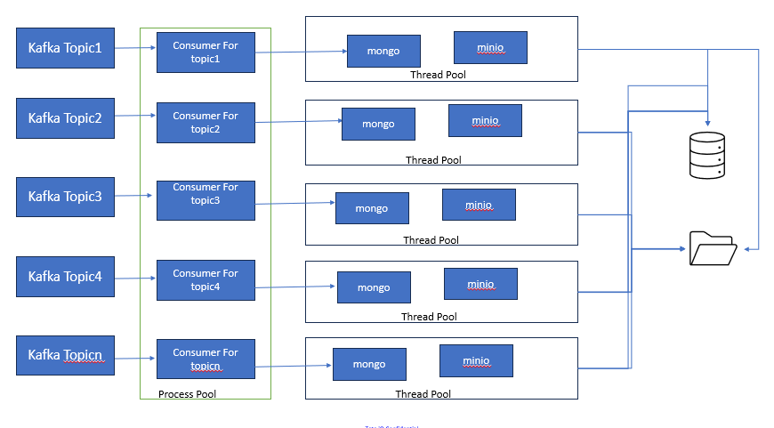

# Introduction 
This is a storage repo. 

# How It Works

1. Check the config for customer id, subsite id, location id or camera group id
2. Aggregate the camera group and get all the camera config and cache the data
3. Read camera configuration from cache
4. Start streaming for camera
5. Check for the update in cache and update the camera configurations

# Architecture

1. Each topic are executed on process pool for the faster image fetch
2. Each task in process pool have threadpool, and each threadpool is running minio and mongo client to store data in mongo and mino

# Dependency
1. This Module is dependent on the https://tatacommiot@dev.azure.com/tatacommiot/Video%20Based%20IoT/_git/vd-iot-dataapiservice
2. This module also needs kafka broker

# Installation
1. Install Python3.9 
2. Install redis-server
3. poetry install

# Run App
chmod +x run.sh
./run.sh

# Docker 
1. Contenirization is enabled
2. change the config.yaml
3. Navigate to the Dockerfile level
4. build the container (sudo docker build -t "postprocess")
5. Run the container (sudo oocker run -t "postprocess")